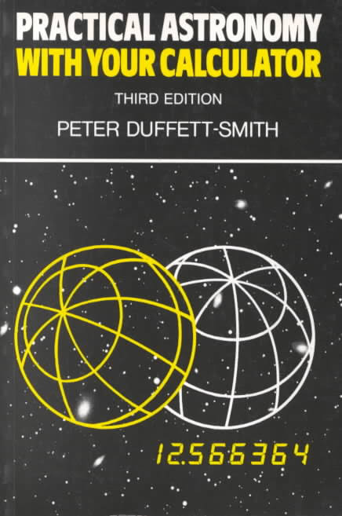

# practical-astronomy

Copyright © 2015 Wayne D Grant

Licensed under the MIT License

Implementations of calculations from '[Practical Astronomy With Your Calculator](https://en.wikipedia.org/wiki/Practical_Astronomy_with_your_Calculator), 3rd Edition' by Peter Duffett-Smith. Written in Javascript.

## Progress

### Time

| No. | Name                                                   | Method(s)                                              |
|-----|--------------------------------------------------------|--------------------------------------------------------|
| 1   | Calendars                                              | daysInMonth                                            |
| 2   | The date of Easter                                     | dateOfEaster                                           |
| 3   | Converting the date to the day number                  | dateToDayNumber, dateToDaysElapsedSinceEpoch           |
| 4   | Julian day numbers                                     | dateToJulianDayNumber, dateToModifiedJulianDayNumber() |
| 5   | Converting the Julian day number to the calendar date  |                                                        |
| 6   | Finding the day of the week                            |                                                        |
| 7   | Converting hours, minutes and seconds to decimal hours |                                                        |
| 8   | Converting decimal hours to hours, minutes and seconds |                                                        |
| 9   | Converting the local time to UT                        |                                                        |
| 10  | Converting UT to local civil time                      |                                                        |
| 11  | Sidereal time (ST)                                     |                                                        |
| 12  | Conversion of UT to GST                                |                                                        |
| 13  | Conversion of GST to UT                                |                                                        |
| 14  | Local Sidereal time (LST)                              |                                                        |
| 15  | Converting LST to GST                                  |                                                        |
| 16  | Ephermeris time (ET) and terrestial dynamic time (TDT) |                                                        |

### Coordinate Systems

| No. | Name                                                                         | Method(s)                                              |
|-----|------------------------------------------------------------------------------|--------------------------------------------------------|
| 17  | Horizon coordinates                                                          |                                                        |
| 18  | Equatorial coordinates                                                       |                                                        |
| 19  | Ecliptic coordinates                                                         |                                                        |
| 20  | Galactic coordinates                                                         |                                                        |
| 21  | Converting between decimal degress and degrees, minutes and seconds          |                                                        |
| 22  | Converting between angles expressed in degrees and angles expressed in hours |                                                        |
| 23  | Converting between one coordinate system and another                         |                                                        |
| 24  | Converting between right ascension and hour-angle                            |                                                        |
| 25  | Equatorial to horizon coordinate conversion                                  |                                                        |
| 26  | Horizon to equatorial coordinate conversion                                  |                                                        |
| 27  | Ecliptic to equatorial coordinate conversion                                 |                                                        |
| 28  | Equatorial to ecliptic coordinate conversion                                 |                                                        |
| 29  | Equatorial to galactic coordinate conversion                                 |                                                        |
| 30  | Galactic to equatorial coordinate conversion                                 |                                                        |
| 31  | Generalised coordinate transformations                                       |                                                        |
| 32  | The angle between two celestial objects                                      |                                                        |
| 33  | Rising and setting                                                           |                                                        |
| 34  | Precession                                                                   |                                                        |
| 35  | Nutation                                                                     |                                                        |
| 36  | Aberration                                                                   |                                                        |
| 37  | Refraction                                                                   |                                                        |
| 38  | Geocentric parallax and the figure of the Earth                              |                                                        |
| 39  | Calculating correction for parallax                                          |                                                        |
| 40  | Heliographic coordinates                                                     |                                                        |
| 41  | Carrington rotation numbers                                                  |                                                        |
| 42  | Selenographic coordinates                                                    |                                                        |
| 43  | Atmospheric extinction                                                       |                                                        |

### The Sun

| No. | Section Name                                    | Method(s)                                              |
|-----|-------------------------------------------------|--------------------------------------------------------|
| 44  | Orbits                                          |                                                        |
| 45  | The apparent orbit of the sun                   |                                                        |
| 46  | Calculating the position of the sun             |                                                        |
| 47  | Calculating orbits more precisely               |                                                        |
| 48  | Calculating the Sun's distance and angular size |                                                        |
| 49  | Sunrise and sunset                              |                                                        |
| 50  | Twilight                                        |                                                        |
| 51  | The equation of time                            |                                                        |
| 52  | Solar elongations                               |                                                        |

### The Planets, Comets and Binary Stars

| No. | Section Name                                                 | Method(s)                                              |
|-----|--------------------------------------------------------------|--------------------------------------------------------|
| 53  | The planetary orbits                                         |                                                        |
| 54  | Calculating the coordinates of a planet                      |                                                        |
| 55  | Finding the approximate positions of the planets             |                                                        |
| 56  | Perturbations in a planet's orbit                            |                                                        |
| 57  | The distance, light-travel time and angular size of a planet |                                                        |
| 58  | The phases of the planets                                    |                                                        |
| 59  | The position-angle of the bright limb                        |                                                        |
| 60  | The apparent brightness of a planet                          |                                                        |
| 61  | Comets                                                       |                                                        |
| 62  | Parabolic orbits                                             |                                                        |
| 63  | Binary-star orbits                                           |                                                        |

### The Moon and Eclipses

| No. | Section Name                                              | Method(s)                                              |
|-----|-----------------------------------------------------------|--------------------------------------------------------|
| 64  | The Moon's orbit                                          |                                                        |
| 65  | Calculating the Moon's position                           |                                                        |
| 66  | The Moon's hourly motions                                 |                                                        |
| 67  | The phases of the Moon                                    |                                                        |
| 68  | The position-angle of the Moon's bright limb              |                                                        |
| 69  | The Moon's distance, angular size and horizontal parallax |                                                        |
| 70  | Moonrise and moonset                                      |                                                        |
| 71  | Eclipses                                                  |                                                        |
| 72  | The 'rules' of eclipses                                   |                                                        |
| 73  | Calculating a lunar eclipse                               |                                                        |
| 74  | Calculating a solar eclipse                               |                                                        |
| 75  | The Astronomical Calendar                                 |                                                        |
