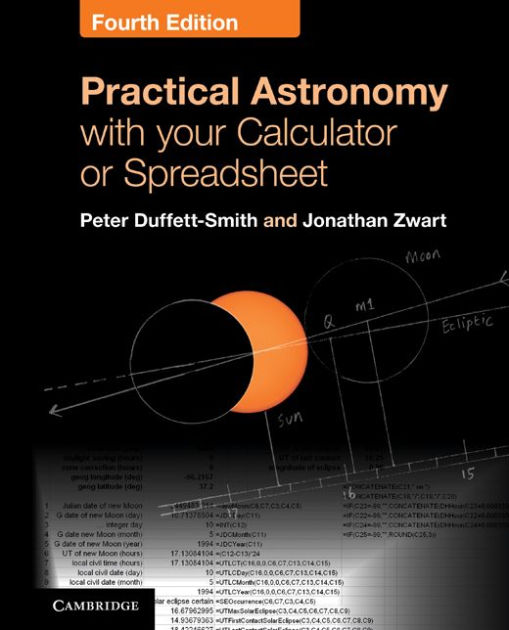

# practical-astronomy

Copyright © 2016 Wayne D Grant

Licensed under the MIT License

Implementations of calculations from '[Practical Astronomy with your Calculator or Spreadsheet](https://en.wikipedia.org/wiki/Practical_Astronomy_with_your_Calculator), 4th Edition' by Peter Duffett-Smith and Jonathan Zwart. Written in Javascript.

## Progress

### Time

| No. | Name                                                             | Method(s)                                                            |
|-----|------------------------------------------------------------------|----------------------------------------------------------------------|
| 1   | Calendars                                                        | daysInMonth                                                          |
| 2   | The date of Easter                                               | dateOfEaster                                                         |
| 3   | Converting the date to the day number                            | dateToDayNumber, dateToDaysElapsedSinceEpoch                         |
| 4   | Julian dates                                                     | dateToJulianDayNumber, dateToModifiedJulianDayNumber                 |
| 5   | Converting the Julian date to the Greenwich calendar date        | julianDayNumberToDate                                                |
| 6   | Finding the name of the day of the week                          | dateToDayOfWeek, julianDayNumberToDayOfWeek                          |
| 7   | Converting hours, minutes and seconds to decimal hours           | hoursMinutesSecondsToDecimalHours                                    |
| 8   | Converting decimal hours to hours, minutes and seconds           | decimalHoursToHoursMinutesSeconds                                    |
| 9   | Converting the local time to Universal Time (UT)                 | localTimeToUniversalTime                                             |
| 10  | Converting UT and Greenwich calendar date to local time and date | universalTimeToLocalTime                                             |
| 11  | Sidereal time (ST)                                               | N/A                                                                  |
| 12  | Conversion of UT to Greenwich sidereal time (GST)                | universalTimeToGreenwichSiderealTime                                 |
| 13  | Conversion of GST to UT                                          | greenwichSiderealTimeToUniversalTime                                 |
| 14  | Local sidereal time (LST)                                        | greenwichSiderealTimeToLocalSiderealTime                             |
| 15  | Converting LST to GST                                            | localSiderealTimeToGreenwichSiderealTime                             |
| 16  | Ephermeris time (ET) and terrestial time (TT)                    | N/A                                                                  |

### Coordinate Systems

| No. | Name                                                                         | Method(s)                                                                              |
|-----|------------------------------------------------------------------------------|----------------------------------------------------------------------------------------|
| 17  | Horizon coordinates                                                          | N/A                                                                                    |
| 18  | Equatorial coordinates                                                       | N/A                                                                                    |
| 19  | Ecliptic coordinates                                                         | N/A                                                                                    |
| 20  | Galactic coordinates                                                         | N/A                                                                                    |
| 21  | Converting between decimal degress and degrees, minutes and seconds          | decimalDegreesToDegreesMinutesSeconds, degreesMinutesSecondsToDecimalDegrees           |
| 22  | Converting between angles expressed in degrees and angles expressed in hours | decimalHoursToDecimalDegrees, decimalDegreesToDecimalHours, hoursMinutesSecondsToDegreesMinutesSeconds degreesMinutesSecondsToHoursMinutesSeconds  |
| 23  | Converting between one coordinate system and another                         | N/A                                                                                    |
| 24  | Converting between right ascension and hour angle                            | rightAscensionToHourAngle, hourAngleToRightAscension                                   |
| 25  | Equatorial to horizon coordinate conversion                                  | equatorialCoordinatesToHorizonCoordinates                                              |
| 26  | Horizon to equatorial coordinate conversion                                  | horizonCoordinatesToEquatorialCoordinates                                              |
| 27  | Ecliptic to equatorial coordinate conversion                                 | meanObliquityOfTheEcliptic, eclipticCoordinatesToEquatorialCoordinates                 |
| 28  | Equatorial to ecliptic coordinate conversion                                 | eclipticCoordinatesToEquatorialCoordinates                                             |
| 29  | Equatorial to galactic coordinate conversion                                 |                                                                                        |
| 30  | Galactic to equatorial coordinate conversion                                 |                                                                                        |
| 31  | Generalised coordinate transformations                                       |                                                                                        |
| 32  | The angle between two celestial objects                                      |                                                                                        |
| 33  | Rising and setting                                                           |                                                                                        |
| 34  | Precession                                                                   |                                                                                        |
| 35  | Nutation                                                                     | nutation                                                                               |
| 36  | Aberration                                                                   |                                                                                        |
| 37  | Refraction                                                                   |                                                                                        |
| 38  | Geocentric parallax and the figure of the Earth                              |                                                                                        |
| 39  | Calculating corrections for parallax                                         |                                                                                        |
| 40  | Heliographic coordinates                                                     |                                                                                        |
| 41  | Carrington rotation numbers                                                  |                                                                                        |
| 42  | Selenographic coordinates                                                    |                                                                                        |
| 43  | Atmospheric extinction                                                       |                                                                                        |

### The Sun

| No. | Section Name                                    | Method(s)                                              |
|-----|-------------------------------------------------|--------------------------------------------------------|
| 44  | Orbits                                          |                                                        |
| 45  | The apparent orbit of the sun                   |                                                        |
| 46  | Calculating the position of the sun             |                                                        |
| 47  | Calculating orbits more precisely               |                                                        |
| 48  | Calculating the Sun's distance and angular size |                                                        |
| 49  | Sunrise and sunset                              |                                                        |
| 50  | Twilight                                        |                                                        |
| 51  | The equation of time                            |                                                        |
| 52  | Solar elongations                               |                                                        |

### The Planets, Comets and Binary Stars

| No. | Section Name                                                 | Method(s)                                              |
|-----|--------------------------------------------------------------|--------------------------------------------------------|
| 53  | The planetary orbits                                         |                                                        |
| 54  | Calculating the coordinates of a planet                      |                                                        |
| 55  | Finding the approximate positions of the planets             |                                                        |
| 56  | Perturbations in a planet's orbit                            |                                                        |
| 57  | The distance, light-travel time and angular size of a planet |                                                        |
| 58  | The phases of the planets                                    |                                                        |
| 59  | The position-angle of the bright limb                        |                                                        |
| 60  | The apparent brightness of a planet                          |                                                        |
| 61  | Comets                                                       |                                                        |
| 62  | Parabolic orbits                                             |                                                        |
| 63  | Binary-star orbits                                           |                                                        |

### The Moon and Eclipses

| No. | Section Name                                              | Method(s)                                              |
|-----|-----------------------------------------------------------|--------------------------------------------------------|
| 64  | The Moon's orbit                                          |                                                        |
| 65  | Calculating the Moon's position                           |                                                        |
| 66  | The Moon's hourly motions                                 |                                                        |
| 67  | The phases of the Moon                                    |                                                        |
| 68  | The position-angle of the Moon's bright limb              |                                                        |
| 69  | The Moon's distance, angular size and horizontal parallax |                                                        |
| 70  | Moonrise and moonset                                      |                                                        |
| 71  | Eclipses                                                  |                                                        |
| 72  | The 'rules' of eclipses                                   |                                                        |
| 73  | Calculating a lunar eclipse                               |                                                        |
| 74  | Calculating a solar eclipse                               |                                                        |
| 75  | The Astronomical Calendar                                 |                                                        |
